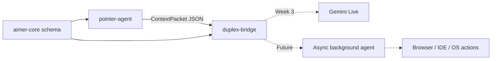

# Aimer

Aimer is a pointer-grounded, full-duplex assistant. The goal is to let a user point
at something on screen and speak naturally, while a low-latency duplex model receives cursor-aware visual context instead of relying on typed prompts.

Week 2 adds the cropped-tile pipeline: a macOS service that emits cursor,
focused-window, Accessibility, selected-text, and cursor-settled 256x256 screen-tile
context at 10 Hz as newline-delimited JSON.

## Architecture



## Repo Layout

- `aimer-core/`: shared Pydantic schema for visual/deictic context packets.
- `pointer-agent/`: Week 1 desktop telemetry service.
- `duplex-bridge/`: provider-neutral duplex session boundary and Gemini Live stub.
- `pointer-extension/`: non-functional Chrome MV3 placeholder for future browser adapters.
- `docs/architecture.md`: Notion spec mapped to repo modules and milestones.

## Quickstart

Install dependencies:

```bash
uv sync
```

Emit five telemetry packets to stdout:

```bash
uv run pointer-agent --limit 5
```

Emit Week 1-style packets without screen tiles:

```bash
uv run pointer-agent --no-tiles --limit 5
```

Write telemetry to JSONL:

```bash
uv run pointer-agent --tiles --output .data/telemetry.jsonl --limit 50
```

## Requirements

- macOS 14 (Sonoma) or newer
- Python 3.12+
- `uv` package manager

## Permissions

macOS may require Accessibility permission for selected text and UI labels:

`System Settings -> Privacy & Security -> Accessibility`

macOS requires Screen Recording permission for cursor-settled screen tiles:

`System Settings -> Privacy & Security -> Screen Recording`

Screen tile capture uses ScreenCaptureKit and requires macOS 14 (Sonoma) or newer. On older macOS, tile capture is silently disabled and only cursor/accessibility context flows.

## Development

Run tests:

```bash
uv run pytest
```

Run linting and formatting checks:

```bash
uv run ruff check .
uv run ruff format --check .
uv run mypy aimer-core/src pointer-agent/src duplex-bridge/src
```

## Week 3: Duplex bridge

Run the duplex bridge with Gemini Live:

```bash
# Terminal 1 (model bridge)
export GEMINI_API_KEY=...
uv run -m duplex_bridge --host 127.0.0.1 --port 8765

# Terminal 2 (pointer agent)
uv run -m pointer_agent --hz 10 --ws-url ws://127.0.0.1:8765/context
```

The pointer agent streams ContextPackets over WebSocket to the duplex bridge, which forwards visual context (screen tiles and cursor metadata) to Gemini Live.

## Roadmap

- Week 1: pointer telemetry harness at 10 Hz.
- Week 2: cropped 256x256 cursor tile pipeline.
- Week 3 (current): Gemini Live bridge with WebSocket transport and visual context.
- Week 4: microphone capture and audio input pipeline.
- Week 5: entity extraction from hover regions.
- Week 6: async background worker for long-running tools.
- Week 7: browser and IDE host actions.
- Week 8: FD-bench-style and pointer-deixis evals.

## License

Proprietary — all rights reserved. See [LICENSE](./LICENSE).
