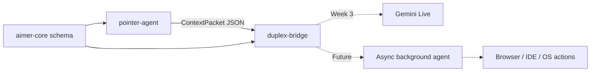

# Aimer

Aimer is a pointer-grounded, full-duplex assistant. The goal is to let a user point
at something on screen and speak naturally, while a low-latency duplex model receives cursor-aware visual context instead of relying on typed prompts.

Week 1 implements the pointer telemetry harness: a macOS service that emits cursor,
focused-window, Accessibility, and selected-text context at 10 Hz as newline-delimited
JSON.

## Architecture



## Repo Layout

- `aimer-core/`: shared Pydantic schema for visual/deictic context packets.
- `pointer-agent/`: Week 1 desktop telemetry service.
- `duplex-bridge/`: provider-neutral duplex session boundary and Gemini Live stub.
- `pointer-extension/`: non-functional Chrome MV3 placeholder for future browser adapters.
- `docs/architecture.md`: Notion spec mapped to repo modules and milestones.

## Quickstart

Install dependencies:

```bash
uv sync
```

Emit five telemetry packets to stdout:

```bash
uv run pointer-agent --limit 5
```

Write telemetry to JSONL:

```bash
uv run pointer-agent --output .data/telemetry.jsonl --limit 50
```

macOS may require Accessibility permission for selected text and UI labels:

`System Settings -> Privacy & Security -> Accessibility`

Screen Recording permission is not required for Week 1 because pixel capture is stubbed
until Week 2.

## Development

Run tests:

```bash
uv run pytest
```

Run linting and formatting checks:

```bash
uv run ruff check .
uv run ruff format --check .
uv run mypy aimer-core/src pointer-agent/src duplex-bridge/src
```

## Roadmap

- Week 1: pointer telemetry harness at 10 Hz.
- Week 2: cropped 256x256 cursor tile pipeline.
- Week 3: Gemini Live bridge with audio plus visual context.
- Week 4: deictic resolver for "this" and "that" commands.
- Week 5: entity extraction from hover regions.
- Week 6: async background worker for long-running tools.
- Week 7: browser and IDE host actions.
- Week 8: FD-bench-style and pointer-deixis evals.

## License

Proprietary — all rights reserved. See [LICENSE](./LICENSE).
