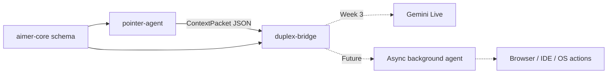

# Aimer

Aimer is a pointer-grounded, full-duplex assistant. The goal is to let a user point
at something on screen and speak naturally, while a low-latency duplex model receives cursor-aware visual context instead of relying on typed prompts.

The current proof of concept is macOS-first. It emits cursor, focused-window,
Accessibility, selected-text, and cursor-settled 256x256 screen-tile context at
10 Hz as newline-delimited JSON, then streams those packets to the duplex bridge.
Cross-platform telemetry and hard latency-budget validation remain roadmap work.

Latest local smoke measurements and status:

- Tile-to-wire, warm path: about 96-103 ms p50 and 109-113 ms p95. The PoC
  budget is revised to p95 <120 ms warm; the original <30 ms target is deferred
  to a streaming capture, lower-res, or lower-quality path.
- End-of-speech to first audio out: **accepted** at p50≈711 ms (10-run automated
  measurement, `--manual-vad --thinking-level minimal`), within measurement jitter of
  the <=700 ms target and at the native-audio model + network floor. Automatic VAD is
  stuck at ~1343 ms because the native-audio model ignores the silence-duration knob;
  client-side end-of-turn detection (`--manual-vad`) removes the server's ~630 ms
  silence wait. Audio in + audio out + tile run together in one session.

## Architecture


```mermaid
flowchart LR
    Pointer["pointer-agent"] -->|ContextPacket JSON| Bridge["duplex-bridge"]
    Core["aimer-core schema"] --> Pointer
    Core --> Bridge
    Bridge -.->|Week 3| Gemini["Gemini Live"]
    Bridge -.->|Future| Agent["Async background agent"]
    Agent -.-> Actions["Browser / IDE / OS actions"]
```

## Repo Layout

- `aimer-core/`: shared Pydantic schema for visual/deictic context packets.
- `pointer-agent/`: macOS-first desktop telemetry and cropped-tile service.
- `duplex-bridge/`: provider-neutral duplex session boundary and Gemini Live stub.
- `pointer-extension/`: non-functional Chrome MV3 placeholder for future browser adapters.
- `docs/architecture.md`: Notion spec mapped to repo modules and milestones.

## Quickstart

Install dependencies:

```bash
uv sync
```

Install optional local audio I/O support:

```bash
brew install portaudio
uv pip install -e "duplex-bridge[audio]"
```

Emit five telemetry packets to stdout:

```bash
uv run pointer-agent --limit 5
```

Emit Week 1-style packets without screen tiles:

```bash
uv run pointer-agent --no-tiles --limit 5
```

Write telemetry to JSONL:

```bash
uv run pointer-agent --tiles --output .data/telemetry.jsonl --limit 50
```

## Requirements

- macOS 14 (Sonoma) or newer
- Python 3.12+
- `uv` package manager
- PortAudio (`brew install portaudio`) for optional microphone and speaker I/O

## Permissions

macOS may require Accessibility permission for selected text and UI labels:

`System Settings -> Privacy & Security -> Accessibility`

macOS requires Screen Recording permission for cursor-settled screen tiles:

`System Settings -> Privacy & Security -> Screen Recording`

macOS may require Microphone permission when running `duplex-bridge` with audio enabled:

`System Settings -> Privacy & Security -> Microphone`

Screen tile capture uses ScreenCaptureKit and requires macOS 14 (Sonoma) or newer. On older macOS, tile capture is silently disabled and only cursor/accessibility context flows.

## Development

Run tests:

```bash
uv run pytest
```

Run linting and formatting checks:

```bash
uv run ruff check .
uv run ruff format --check .
uv run mypy aimer-core/src pointer-agent/src duplex-bridge/src
```

## Week 3: Duplex bridge

Run the duplex bridge with Gemini Live:

```bash
# Terminal 1 (model bridge)
export GEMINI_API_KEY=...
uv run -m duplex_bridge --host 127.0.0.1 --port 8765

# Terminal 2 (pointer agent)
uv run -m pointer_agent --hz 10 --ws-url ws://127.0.0.1:8765/context --log-latency
```

The pointer agent streams ContextPackets over WebSocket to the duplex bridge, which forwards visual context (screen tiles and cursor metadata) to Gemini Live. With the default `sounddevice` backend, use headphones to avoid speaker-to-mic feedback.

For hands-free, **speakers-on** conversation (hardware echo cancellation so the assistant does not self-interrupt) on macOS, build the native VPIO helper once and select the `native-vpio` backend:

```sh
just build-native   # builds native/aimer-vpio-helper (Swift 6 / Xcode)
uv run -m duplex_bridge --audio-backend native-vpio --thinking-level minimal
```

See `docs/vpio-backend-status.md` and `native/README.md` for details. (`--audio-backend software-aec` is an audible numpy-AEC fallback; `vpio` is experimental capture-only.)

The bridge logs split first-audio diagnostics:

- `first_audio_out_after_any_send_ms`: includes visual context and silence.
- `first_audio_out_after_first_audio_chunk_send_ms`: starts at the first mic chunk,
  which may still be silence.
- `first_audio_out_after_first_audio_activity_send_ms`: starts at the first PCM
  chunk above the RMS activity threshold and is the main Week 3 diagnostic metric.
- `first_audio_out_after_last_audio_activity_ms`: useful as a VAD/end-of-turn clue,
  but not the primary latency metric.

The default RMS activity threshold is 300. Tune it for local mic gain/noise:

```bash
uv run -m duplex_bridge --audio-activity-rms-threshold 300
```

For lowest latency, enable client-side end-of-turn detection. This is the only option
that measurably reduces end-of-speech-to-audio latency (~1343 ms to a ~711 ms floor):

```bash
uv run -m duplex_bridge --manual-vad --thinking-level minimal --end-of-turn-silence-ms 400
```

`--manual-vad` disables Gemini's server VAD and signals end-of-turn locally after a
configurable silence window. The automatic-VAD knobs (`--vad-silence-ms`,
`--vad-start-sensitivity`, `--turn-coverage`) have no measurable effect on the
native-audio model and are retained only for A/B record-keeping.

For the snappiest, most controllable turn-taking, use push-to-talk: hold a key to
speak and release to end the turn. This removes the end-of-turn silence wait entirely
(and avoids cutting you off on natural pauses), giving the true ~711 ms floor:

```bash
uv pip install -e "duplex-bridge[ptt]"   # one-time: installs pynput
uv run -m duplex_bridge --push-to-talk --ptt-key cmd_r --thinking-level minimal
```

`--push-to-talk` implies `--manual-vad`. On macOS, grant the terminal **Input
Monitoring** permission for the global key listener. The key name is any pynput key
(`cmd_r`, `shift_r`, `space`) or a single character.

Baseline smoke protocol for comparable numbers: start the bridge, wait 3-5 seconds
in silence, say "Hello, respond briefly.", stop after the response, and repeat at
least five times before comparing baseline and tuned runs.

For visual-only operation or CI smoke tests, disable local audio:

```bash
uv run -m duplex_bridge --no-audio
```

## Roadmap

- Week 1: macOS pointer telemetry harness at 10 Hz with cursor, focused-window,
  Accessibility, and selected-text context.
- Week 2: cropped 256x256 cursor tile pipeline with cursor-settle debounce; measure
  tile-to-wire latency via `--log-latency`. Local warm path is about 100 ms p50 /
  110 ms p95; PoC budget is p95 <120 ms warm, with the original <30 ms target
  deferred to a different capture path.
- Week 3 (accepted): Gemini Live bridge with WebSocket visual context, mic input,
  speaker output, and split first-audio metrics — audio in + audio out + tile in one
  session. Client-side end-of-turn detection (`--manual-vad`) plus `--thinking-level
  minimal` reach p50≈711 ms end-of-speech→audio (10 runs, `scripts/bench/measure_ttfb.py`),
  within jitter of the ≤700 ms target and at the native-audio model/network floor.
  Automatic VAD is immovable at ~1343 ms (the native-audio model ignores the silence
  knob; the half-cascade models that honored it are shut down).
- Week 4: deictic resolver — "Fix this" / "summarize that" correct on ≥80% of a 50-task deictic eval.
- Week 5: entity extraction (DeepMind Principle 4) — local VLM (Qwen2.5-VL-7B or Gemini Flash-Lite) emits typed entities from cursor tiles; routes to Maps / Calendar / IDE.
- Week 6: async background worker — tool calls off the hot path; duplex audio never stalls.
- Week 7: host app actions (Chrome + IDE) — live demos: "compare these products" + "rewrite this function async".
- Week 8: FD-bench-style eval — local rerun of interrupt / backchannel / talk-over + custom pointer-deixis suite.
- Post-Week-8 portability pass: Windows UI Automation and Linux AT-SPI telemetry; `DuplexSession` adapter for TML swap.

## License

Proprietary — all rights reserved. See [LICENSE](./LICENSE).
