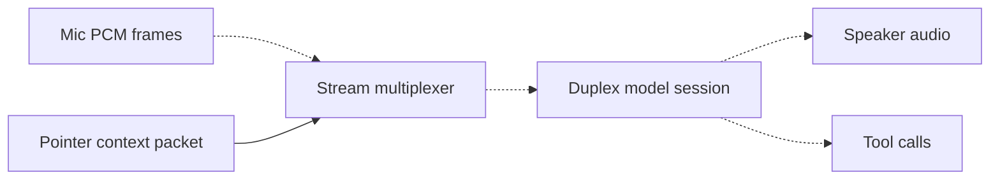

# Aimer Architecture

This document maps the Notion brief into repo structure and implementation milestones.
The source product spec is the Notion page for the project now named Aimer.

## Overview

Aimer is a full-duplex audio/vision assistant whose visual stream is grounded in the
user's cursor-aware screen context. The product thesis is to remove three costs:

- Turn-taking lag: listen and speak simultaneously.
- Prompt-writing tax: point and speak instead of typing prompts.
- App-switching tax: work across host apps at the pointer level.

## Component 1: Duplex Frontend

Repo location: `duplex-bridge/`

The duplex frontend owns the provider-neutral `DuplexSession` interface. The Week 1
repo defines the interface and a `GeminiLiveSession` stub only. The Week 3 milestone
will connect it to Gemini Live.

Provider targets:

- v1: Gemini Live API.
- Backup: OpenAI Realtime.
- OSS/self-host path: Moshi plus SGLang streaming sessions.
- v2 swap target: TML Interaction Small when accessible.

## Component 2: Context-Aware Pointer

Repo location: `pointer-agent/`

The pointer layer emits one structured context packet per tick. Week 2 implements
macOS cursor context plus debounced pixel tiles:

- Cursor position via Quartz.
- Focused app/window metadata via Cocoa and Accessibility APIs.
- Selected text and accessibility labels via AX APIs.
- Pixel hover region via ScreenCaptureKit when the cursor has settled for ~150 ms.

The pixel path captures a 256x256-point source rect centered on the cursor, then
downsamples the ScreenCaptureKit CGImage to a bounded 256x256-pixel JPEG payload.
Packet coordinates remain in logical points; `ContextPacket.display_scale` preserves
the screen scale for consumers that need physical pixel reconstruction.

Shared packet schema lives in `aimer-core/` so `pointer-agent` and `duplex-bridge`
consume the same model.

## Component 3: Stream Multiplexer

Repo locations:

- `pointer-agent/src/pointer_agent/telemetry.py`
- `pointer-agent/src/pointer_agent/transport.py`

Week 1 emits newline-delimited JSON at 10 Hz to stdout or a JSONL file. Week 3 adds
WebSocket transport into `duplex-bridge`.

### Wire format & transport

The capture loop emits `ContextPacket` instances at 10 Hz. Each packet is serialized via `ContextPacket.model_dump_json()` and sent over WebSocket to `WebSocketContextServer` in `duplex-bridge`. The server parses incoming JSON, validates against the `ContextPacket` schema, and forwards valid packets to the `DuplexSession` via `send_visual_context()`. Screen tiles are base64-encoded JPEG payloads in the `hover_region.tile_b64` field; other fields provide cursor position, focused window metadata, and selected text for deictic grounding.

## Component 4: Async Background Agent

Repo location: future package/service.

The Notion brief requires long-running work such as web search, file I/O, code edits,
and multi-step reasoning to run off the real-time audio path. Week 1 does not create
this service. The boundary will be tool calls emitted from `DuplexSession`.

## Component 5: Action Layer

Repo locations: future adapters.

The action layer will eventually target:

- Browser actions through Accessibility APIs, AppleScript, CDP, or a Chrome extension.
- IDE actions through LSP, direct file writes, or `cursor-agent`.
- OS actions through AppleScript, UI Automation, or AT-SPI.

The repo includes `pointer-extension/` only as an explicit placeholder for a future
Chrome MV3 browser adapter. It is not used by Week 1.

## Milestone Map

| Week | Milestone | Repo surface |
| --- | --- | --- |
| 1 | Pointer telemetry harness | `pointer-agent/`, `aimer-core/` |
| 2 | Cropped-tile pipeline | `pointer-agent/capture/macos/screen.py`, `pointer-agent/capture/macos/__init__.py`, `pointer-agent/__main__.py` |
| 3 | Gemini Live integration | `duplex-bridge/`, `pointer-agent/transport.py` |
| 4 | Deictic resolver | likely `aimer-core/` + `duplex-bridge/` |
| 5 | Entity extraction | local VLM adapter, hover-region enrichment |
| 6 | Async background worker | future worker service |
| 7 | Host app actions | browser, IDE, OS action adapters |
| 8 | FD-bench-style eval | future eval harness |

## Stack Picks

| Layer | Week 1 choice | Why |
| --- | --- | --- |
| Workspace | `uv` | Fast Python workspace/dependency management |
| Shared schema | Pydantic v2 | Strict JSON packet validation |
| Pointer capture | PyObjC Quartz/Cocoa/ApplicationServices/ScreenCaptureKit | Native macOS cursor/window/AX/tile access |
| Telemetry output | stdout/JSONL | Easy to inspect and replay |
| Duplex boundary | `DuplexSession` ABC | Keeps Gemini, Realtime, Moshi, and TML swappable |
| Browser option | Chrome MV3 stub | Preserves future DOM/action path without committing Week 1 to it |

## Risks and Mitigations

- Latency budget: keep Week 1 capture synchronous, small, and local; model calls stay
  out of the telemetry loop.
- Privacy: pixel capture is stubbed in Week 1; future screen capture should add
  allowlists, push-to-look, and on-device redaction before cloud transport.
- Deixis ambiguity: the shared schema supports cursor, focus window, selected text,
  hover region, and extracted entities so later resolvers have multiple signals.
- Vendor lock-in: `DuplexSession` is provider-neutral from day one.
- Benchmark gap: JSONL telemetry output gives a replayable substrate for the custom
  pointer-deixis benchmark planned for Week 8.
