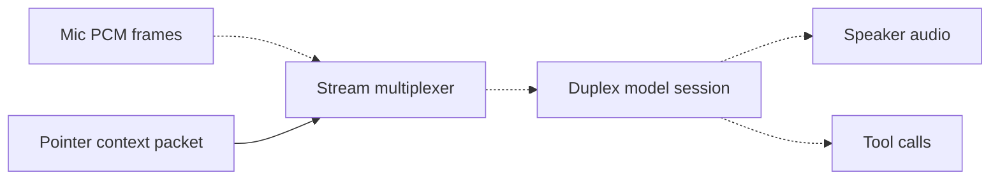

# Aimer Architecture

This document maps the Notion brief into repo structure and implementation milestones.
The source product spec is the Notion page for the project now named Aimer.

## Overview

Aimer is a full-duplex audio/vision assistant whose visual stream is grounded in the
user's cursor-aware screen context. The product thesis is to remove three costs:

- Turn-taking lag: listen and speak simultaneously.
- Prompt-writing tax: point and speak instead of typing prompts.
- App-switching tax: work across host apps at the pointer level.

## Component 1: Duplex Frontend

Repo location: `duplex-bridge/`

The duplex frontend owns the provider-neutral `DuplexSession` interface. The current
implementation connects `GeminiLiveSession` to Gemini Live, accepts visual context
over WebSocket, and can run same-machine microphone capture plus speaker playback
when optional audio dependencies are installed.

Provider targets:

- v1: Gemini Live API.
- Backup: OpenAI Realtime.
- OSS/self-host path: Moshi plus SGLang streaming sessions.
- v2 swap target: TML Interaction Small when accessible.

## Component 2: Context-Aware Pointer

Repo location: `pointer-agent/`

The pointer layer emits one structured context packet per tick. Week 2 implements
macOS cursor context plus debounced pixel tiles:

- Cursor position via Quartz.
- Focused app/window metadata via Cocoa and Accessibility APIs.
- Selected text and accessibility labels via AX APIs.
- Pixel hover region via ScreenCaptureKit when the cursor has settled for ~150 ms.

The pixel path captures a 256x256-point source rect centered on the cursor, then
downsamples the ScreenCaptureKit CGImage to a bounded 256x256-pixel JPEG payload.
Packet coordinates remain in logical points; `ContextPacket.display_scale` preserves
the screen scale for consumers that need physical pixel reconstruction.

Shared packet schema lives in `aimer-core/` so `pointer-agent` and `duplex-bridge`
consume the same model.

## Component 3: Stream Multiplexer

Repo locations:

- `pointer-agent/src/pointer_agent/telemetry.py`
- `pointer-agent/src/pointer_agent/transport.py`

The pointer agent emits newline-delimited JSON at 10 Hz to stdout or a JSONL file,
or streams the same `ContextPacket` payloads over WebSocket to `duplex-bridge`.
Latency profiling can be enabled with `--log-latency`; in that mode the WebSocket
sink waits for `ws.send()` completion so tile-to-wire timing is not just queue
insertion.

### Wire format & transport

The capture loop emits `ContextPacket` instances at 10 Hz. Each packet is serialized via `ContextPacket.model_dump_json()` and sent over WebSocket to `WebSocketContextServer` in `duplex-bridge`. The server parses incoming JSON, validates against the `ContextPacket` schema, and forwards valid packets to the `DuplexSession` via `send_visual_context()`. Screen tiles are base64-encoded JPEG payloads in the `hover_region.tile_b64` field; other fields provide cursor position, focused window metadata, and selected text for deictic grounding.

```mermaid
flowchart LR
    Mic["Mic PCM frames"] -.-> Multiplexer["Stream multiplexer"]
    Pointer["Pointer context packet"] --> Multiplexer
    Multiplexer -.-> Model["Duplex model session"]
    Model -.-> AudioOut["Speaker audio"]
    Model -.-> ToolCalls["Tool calls"]
```

## Component 4: Async Background Agent

Repo location: future package/service.

The Notion brief requires long-running work such as web search, file I/O, code edits,
and multi-step reasoning to run off the real-time audio path. Week 1 does not create
this service. The boundary will be tool calls emitted from `DuplexSession`.

## Component 5: Action Layer

Repo locations: future adapters.

The action layer will eventually target:

- Browser actions through Accessibility APIs, AppleScript, CDP, or a Chrome extension.
- IDE actions through LSP, direct file writes, or `cursor-agent`.
- OS actions through AppleScript, UI Automation, or AT-SPI.

The repo includes `pointer-extension/` only as an explicit placeholder for a future
Chrome MV3 browser adapter. It is not used by Week 1.

## Milestone Map

| Week | Milestone | Repo surface |
| --- | --- | --- |
| 1 | macOS pointer telemetry harness | Implemented for macOS in `pointer-agent/`, `aimer-core/`; Windows UIA and Linux AT-SPI are deferred to a portability pass |
| 2 | Cropped-tile pipeline | Implemented in `pointer-agent/capture/macos/screen.py`; `--log-latency` records capture, JPEG, base64, packet build, WebSocket send, and total tile-to-wire timings. Observed warm path is about 100 ms p50 / 110 ms p95. PoC budget is revised to p95 <120 ms warm; original <30 ms is deferred to streaming capture, lower-res, or lower-quality work |
| 3 | Gemini Live audio + visual session | **Accepted.** Implemented in `duplex-bridge/` with local audio I/O, WebSocket visual context, split first-audio metrics, RMS audio-activity detection, audio health logs, and client-side end-of-turn detection (`--manual-vad`). Audio in + audio out + tile run in one session. Authoritative measurement (10 runs, `scripts/bench/measure_ttfb.py --manual-vad --thinking-level minimal`): `last_activity→response` (end-of-speech → first audio) p50=711 ms p95=815 ms — within jitter of the ≤700 ms target and at the native-audio model/network floor. Automatic VAD is immovable at ~1343 ms; see Week 3 Latency Diagnosis. |
| 4 | Deictic resolver | "Fix this" / "summarize that" eval; `extracted_entities` stub in schema |
| 5 | Entity extraction | local VLM adapter (Qwen2.5-VL-7B or Gemini Flash-Lite), hover-region enrichment |
| 6 | Async background worker | tool calls off the hot path; duplex audio never stalls |
| 7 | Host app actions | Chrome + IDE live demos |
| 8 | FD-bench-style eval | interrupt / backchannel / talk-over + pointer-deixis suite |

## Stack Picks

| Layer | Week 1 choice | Why |
| --- | --- | --- |
| Workspace | `uv` | Fast Python workspace/dependency management |
| Shared schema | Pydantic v2 | Strict JSON packet validation |
| Pointer capture | PyObjC Quartz/Cocoa/ApplicationServices/ScreenCaptureKit | Native macOS cursor/window/AX/tile access |
| Telemetry output | stdout/JSONL | Easy to inspect and replay |
| Local audio I/O | optional `sounddevice` + PortAudio | Same-machine PoC microphone capture and speaker playback |
| Duplex boundary | `DuplexSession` ABC | Keeps Gemini, Realtime, Moshi, and TML swappable |
| Browser option | Chrome MV3 stub | Preserves future DOM/action path without committing Week 1 to it |

## Risks and Mitigations

- Latency budget: keep Week 1 capture synchronous, small, and local; model calls stay
  out of the telemetry loop.
- Privacy: pixel capture is stubbed in Week 1; future screen capture should add
  allowlists, push-to-look, and on-device redaction before cloud transport.
- Deixis ambiguity: the shared schema supports cursor, focus window, selected text,
  hover region, and extracted entities so later resolvers have multiple signals.
- Vendor lock-in: `DuplexSession` is provider-neutral from day one.
- Benchmark gap: JSONL telemetry output gives a replayable substrate for the custom
  pointer-deixis benchmark planned for Week 8.
- Audio feedback: local speaker output can leak into the microphone. The `AudioBackend`
  seam (`duplex_bridge.audio_backends`) lets one backend own both capture and playback,
  which OS-level echo cancellation requires. `--audio-backend native-vpio` (a native
  Swift VPIO helper in `native/`, spawned as a subprocess) gives hardware echo
  cancellation for hands-free, speakers-on use; `software-aec` is a numpy-AEC fallback;
  the default `sounddevice` backend has none (use headphones). See
  `docs/vpio-backend-status.md`.
- First-audio measurement: continuous mic capture can include pre-speech silence.
  The bridge now separates visual-send, first-audio-chunk, first-audio-activity,
  and last-audio-activity timings; `first_audio_out_after_first_audio_activity_send_ms`
  is the main Week 3 diagnostic metric.

## Week 3 Latency Diagnosis

The acceptance metric is `first_audio_out_after_last_audio_activity_ms` (end-of-speech
to first audio out). The bridge logs four split first-audio metrics so this can be
isolated from phrase duration and pre-speech silence:

- `first_audio_out_after_any_send_ms`
- `first_audio_out_after_first_audio_chunk_send_ms`
- `first_audio_out_after_first_audio_activity_send_ms` (inflated by phrase duration)
- `first_audio_out_after_last_audio_activity_ms` (primary; end-of-speech → audio)

### Finding: manual VAD is the only effective lever

A full sweep of Gemini's automatic-VAD knobs (`silence_duration_ms` 200–1000 ms,
`start`/`end` sensitivity, `turn_coverage`) produced an immovable `last_activity→response`
of ~1343 ms p50. The native-audio model (`gemini-3.1-flash-live-preview`) accepts the
`AutomaticActivityDetection` fields without error but ignores the silence-duration knob;
the half-cascade models that honored it (`gemini-2.0-flash-live-001`) are shut down.

`--manual-vad` disables server VAD (`automatic_activity_detection.disabled=true`) and
signals end-of-turn explicitly via `send_activity_end()`. This removes the server's
~630 ms silence wait and drops `last_activity→response` to **p50≈711 ms** (10 runs,
`scripts/bench/measure_ttfb.py --manual-vad --thinking-level minimal`) — the native-audio
model + network floor. `--thinking-level minimal` is the largest remaining model-side
lever. Warm vs cold turns are negligible for this model.

The 711 ms floor assumes end-of-turn at the true end of speech (explicit / push-to-talk
or an oracle VAD). For continuous-mic capture, `MicCapture` runs a client-side VAD: it
sends `activity_start` on speech onset and `activity_end` after `--end-of-turn-silence-ms`
(default 400 ms) of sub-threshold audio, and does not forward inter-turn silence (the Live
API rejects audio after `activity_end`). Continuous-mic latency is therefore the silence
window + ~711 ms, still well under automatic VAD's ~1343 ms.

### Measurement protocol

`scripts/bench/measure_ttfb.py` drives `GeminiLiveSession` directly (no WebSocket/pointer
agent), generating speech with macOS `say` + ffmpeg as 16 kHz mono int16 PCM. Re-measure
with `uv run python scripts/bench/measure_ttfb.py --manual-vad --thinking-level minimal`. For
manual smoke runs of the full bridge: start it, wait 3-5 s in silence, say "Hello, respond
briefly.", stop after the response, repeat ≥5 times. The RMS activity threshold defaults
to 300 (`--audio-activity-rms-threshold`).
